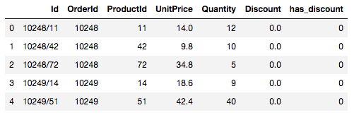

# Introduction
This project, I am investigating the Northwind Database. The purpose of this project is to show relationships that exist or do not exist by using hypothesis testing. Here is an overview of the database. 

**Image using markdown**
<!---you can put in images using a markdown hyperlink--->


**Image using img tag**
<!---you can put in images using an img tag--->


I am asking the following questions

### [**Q1**: Does discount amount effect quantity sold?](#Question1)
    - Test Used
        - Independent Welch's TTest
        - ANOVA
        - TUKEY Test
    - Findings
        - 
### **Q2**: Is there a relationship between reorder level and quantity sold?
-----

## Question1
<details> <summary> Q1 Information</summary>

### Does discount amount have a statistically significant effect on the quantity of a product in an order? If so, at what level(s) of discount?

**Gathering my data**

```
df = get_table(table='OrderDetail')
df.head()
```



**Split up data if it had a discount or not**
```
discounted_vals = df.loc[df['has_discount']>0, 'Quantity']
non_discounted_vals = df.loc[df['has_discount']==0, 'Quantity']
```

**Compare Distributions and test for normality**


```
test_normality(discounted_vals)
p = 6.88120409395894e-26
Therefore the data is not normal

test_normality(non_discounted_vals)
p = 3.803856556577728e-34
Therefore the data is not normal
```
</details>

<details><summary>Q1 Strategy</summary>

Given that this data is not normal, I needed to take sampling distributions. Doing this resulted in this distribution.


</details>

<details open><summary>Q1 Results/Conclusion</summary>

### Results


### Conclusion

### Recommendations

### Further Work
</details>

[Back to Introduction](#Introduction)


```python

```
