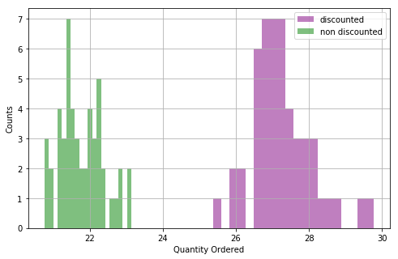

```python
import sqlite3

import numpy as np
import pandas as pd

import scipy.stats as scs
from statsmodels.stats.power import tt_ind_solve_power

import matplotlib.pyplot as plt
import seaborn as sns
```


```python
conn = sqlite3.connect('Northwind_small.sqlite')
cursor = conn.cursor()
```


```python
def get_table(conn=conn, table='Employee'):
    df = pd.read_sql(f'select * from {table}', conn)
    return df


from numpy import std, mean, sqrt

#correct if the population S.D. is expected to be equal for the two groups.
def cohen_d(x,y):
    nx = len(x)
    ny = len(y)
    dof = nx + ny - 2
    return (mean(x) - mean(y)) / sqrt(((nx-1)*std(x, ddof=1) ** 2 + (ny-1)*std(y, ddof=1) ** 2) / dof)
```


```python
cursor.execute('select name from sqlite_master where type="table"').fetchall()
```


    [('Employee',),
     ('Category',),
     ('Customer',),
     ('Shipper',),
     ('Supplier',),
     ('Order',),
     ('Product',),
     ('OrderDetail',),
     ('CustomerCustomerDemo',),
     ('CustomerDemographic',),
     ('Region',),
     ('Territory',),
     ('EmployeeTerritory',)]


# Q1: Does discount amount have a statistically significant effect on the quantity of a product in an order? If so, at what level(s) of discount?


### Obtain the data for the question


```python
df = get_table(table='OrderDetail')
df.head()
```


<div>
<style scoped>
    .dataframe tbody tr th:only-of-type {
        vertical-align: middle;
    }

    .dataframe tbody tr th {
        vertical-align: top;
    }

    .dataframe thead th {
        text-align: right;
    }
</style>
<table border="1" class="dataframe">
  <thead>
    <tr style="text-align: right;">
      <th></th>
      <th>Id</th>
      <th>OrderId</th>
      <th>ProductId</th>
      <th>UnitPrice</th>
      <th>Quantity</th>
      <th>Discount</th>
    </tr>
  </thead>
  <tbody>
    <tr>
      <td>0</td>
      <td>10248/11</td>
      <td>10248</td>
      <td>11</td>
      <td>14.0</td>
      <td>12</td>
      <td>0.0</td>
    </tr>
    <tr>
      <td>1</td>
      <td>10248/42</td>
      <td>10248</td>
      <td>42</td>
      <td>9.8</td>
      <td>10</td>
      <td>0.0</td>
    </tr>
    <tr>
      <td>2</td>
      <td>10248/72</td>
      <td>10248</td>
      <td>72</td>
      <td>34.8</td>
      <td>5</td>
      <td>0.0</td>
    </tr>
    <tr>
      <td>3</td>
      <td>10249/14</td>
      <td>10249</td>
      <td>14</td>
      <td>18.6</td>
      <td>9</td>
      <td>0.0</td>
    </tr>
    <tr>
      <td>4</td>
      <td>10249/51</td>
      <td>10249</td>
      <td>51</td>
      <td>42.4</td>
      <td>40</td>
      <td>0.0</td>
    </tr>
  </tbody>
</table>
</div>


### Split up our data by has_discount


```python
df['has_discount'] = [1 if d > 0 else 0 for d in df.Discount]
df.head()
```


<div>
<style scoped>
    .dataframe tbody tr th:only-of-type {
        vertical-align: middle;
    }

    .dataframe tbody tr th {
        vertical-align: top;
    }

    .dataframe thead th {
        text-align: right;
    }
</style>
<table border="1" class="dataframe">
  <thead>
    <tr style="text-align: right;">
      <th></th>
      <th>Id</th>
      <th>OrderId</th>
      <th>ProductId</th>
      <th>UnitPrice</th>
      <th>Quantity</th>
      <th>Discount</th>
      <th>has_discount</th>
    </tr>
  </thead>
  <tbody>
    <tr>
      <td>0</td>
      <td>10248/11</td>
      <td>10248</td>
      <td>11</td>
      <td>14.0</td>
      <td>12</td>
      <td>0.0</td>
      <td>0</td>
    </tr>
    <tr>
      <td>1</td>
      <td>10248/42</td>
      <td>10248</td>
      <td>42</td>
      <td>9.8</td>
      <td>10</td>
      <td>0.0</td>
      <td>0</td>
    </tr>
    <tr>
      <td>2</td>
      <td>10248/72</td>
      <td>10248</td>
      <td>72</td>
      <td>34.8</td>
      <td>5</td>
      <td>0.0</td>
      <td>0</td>
    </tr>
    <tr>
      <td>3</td>
      <td>10249/14</td>
      <td>10249</td>
      <td>14</td>
      <td>18.6</td>
      <td>9</td>
      <td>0.0</td>
      <td>0</td>
    </tr>
    <tr>
      <td>4</td>
      <td>10249/51</td>
      <td>10249</td>
      <td>51</td>
      <td>42.4</td>
      <td>40</td>
      <td>0.0</td>
      <td>0</td>
    </tr>
  </tbody>
</table>
</div>


### Let's do some basic EDA before we hypothesis test


```python
discounted_vals = df.loc[df['has_discount']>0, 'Quantity']
non_discounted_vals = df.loc[df['has_discount']==0, 'Quantity']
```


```python
plt.figure(figsize=(8, 5))
plt.grid()
plt.hist(discounted_vals.values, label='discounted', bins=30, color='purple', alpha=0.5)
plt.hist(non_discounted_vals.values, label='non discounted', bins=30, color='g', alpha=0.5)
plt.legend()
plt.xlabel("Quantity Ordered")
plt.ylabel("Counts")
plt.show()
```


Eyeballing this, they look fairly similar, skewed to the left.  

#### Test this using an indepedent Ttest

Assumptions
- is our data normally distributed
    - shapiro
- are their variances equal
    - levene


```python
def test_normality(x):
    t, p = scs.shapiro(x)
    if p < 0.05:
        print(f"p = {p}\nTherefore the data is not normal")
        return False
    print(f"p = {p}\nTherefore the data is normal")
    return True


def test_equal_variances(x1, x2):
    """
    h0: var_x1 = var_x2
    ha: var_x1 != var_x2
    """
    t, p = scs.levene(x1, x2)
    if p < 0.05:
        print(f"p = {p}\nTherefore the data do not have equal variances")
        return False
    print(f"p = {p}\nTherefore the data have equal variances")
    return True
```


```python
# Assumption 1 - our data is normally distributed
# H0: the data was drawn from a normal distribution.
# HA: the data was drawn from a non-normal distribution.
# pvalue > 0.05 -> fail to reject the null -> normal

test_normality(discounted_vals)
test_normality(non_discounted_vals)
```

    p = 6.88120409395894e-26
    Therefore the data is not normal
    p = 3.803856556577728e-34
    Therefore the data is not normal


    False


### Our data is not normal! So what do we do? 
Take a sampling distribution of the means


```python
# let's take a sampling distribution of the mean quantity
discounted_sample_means = []
non_discounted_sample_means = []


for i in range(30):
    # what kind of sampling is this? Bootstrap Sampling
    dis_samp = np.random.choice(discounted_vals, size=discounted_vals.shape[0], replace=True).mean()
    discounted_sample_means.append(dis_samp)
    
    non_dis_samp = np.random.choice(non_discounted_vals, size=non_discounted_vals.shape[0], replace=True).mean()
    non_discounted_sample_means.append(non_dis_samp)
```


```python
test_normality(discounted_sample_means)
test_normality(non_discounted_sample_means)
```

    p = 0.1761559098958969
    Therefore the data is normal
    p = 0.2854227125644684
    Therefore the data is normal


    True


### Now test our other assumption for equal variances


```python
test_equal_variances(discounted_sample_means, non_discounted_sample_means)
```

    p = 0.04114854778056398
    Therefore the data do not have equal variances


    False


### let's plot the sampling distributions just to eyeball it


```python
plt.figure(figsize=(8, 5))
plt.grid()
plt.hist(discounted_sample_means, label='discounted', bins=20, color='purple', alpha=0.5)
plt.hist(non_discounted_sample_means, label='non discounted', bins=20, color='g', alpha=0.5)
plt.legend()
plt.xlabel("Quantity Ordered")
plt.ylabel("Counts")
plt.show()
```


### Let's run our TTest
* H0: mu_1 = mu_2
* HA: mu_1 != mu_2


```python
scs.ttest_ind(discounted_sample_means, non_discounted_sample_means)
```


    Ttest_indResult(statistic=30.595498720178167, pvalue=1.758314121708753e-37)


```python
scs.ttest_ind(discounted_sample_means, non_discounted_sample_means, equal_var=False)
```


    Ttest_indResult(statistic=30.595498720178167, pvalue=5.038362375481306e-35)


Given a p-value of 0 this means that our means are not equal and we **reject the null hypothesis, H0**

### Let's run a simulation on this using the mean and sample standard deviation


```python
dis_mu = np.mean(discounted_sample_means)
dis_std = np.std(discounted_sample_means, ddof=1)

non_dis_mu = np.mean(non_discounted_sample_means)
non_dis_std = np.std(non_discounted_sample_means, ddof=1)
```


```python
dis_samp = np.random.normal(loc=dis_mu, scale=dis_std, size=50)
non_dis_samp = np.random.normal(loc=non_dis_mu, scale=non_dis_std, size=50)
```


```python
plt.figure(figsize=(8, 5))
plt.grid()
plt.hist(dis_samp, label='discounted', bins=20, color='purple', alpha=0.5)
plt.hist(non_dis_samp, label='non discounted', bins=20, color='g', alpha=0.5)
plt.legend()
plt.xlabel("Quantity Ordered")
plt.ylabel("Counts")
plt.show()
```





```python
scs.ttest_ind(dis_samp, non_dis_samp, equal_var=True)
```


    Ttest_indResult(statistic=38.18054785119899, pvalue=1.2134590428681277e-60)


```python
effect_size = cohen_d(discounted_sample_means, non_discounted_sample_means)
effect_size
```


    7.899723800810692


```python
power = tt_ind_solve_power(effect_size=effect_size, nobs1=100, alpha=0.5)
power
```


    1.0


Discounts have an effects size of **9.22** which massive. So, therefore, we can conclude that the discounts do effect the quantity ordered. 

### Run tests on data divided by discount level


```python

```
